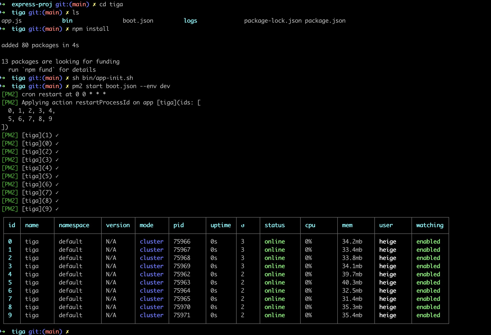
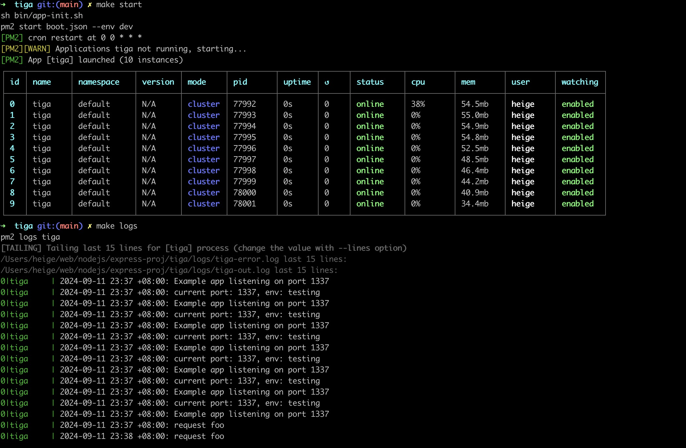

# express-proj
express5.0+ practical project requires nodejs 18 or later.

# Global install
```shell
npm install -g express@5.0.0
```

# Getting started
 1. Project init
```shell
mkdir tiga
cd tiga
npm init
# entry point: (index.js)：Enter app.js, or whatever you want the name of the main file to be. If you want it to be index.js, hit RETURN to accept the suggested default file name.
npm install express@5.0.0
```
2. Create app.js
```shell
touch app.js
```
3. Add the following code
```js
// import express
const express = require('express');
const app = express();
const port = 1337; // application port

// set router
app.get('/', (req, res) => {
  res.send('Hello World!')
});

// bind port to run application
app.listen(port, () => {
  console.log(`Example app listening on port ${port}`)
});
```
4. run app
```shell
node app.js # or add cmd: "start": "node app.js" to package.json scripts，then `npm start`.
```
output:
Example app listening on port 1337

Here a simple express 5.0 runs successfully!

Then, load http://localhost:3000/ in a browser to see the output.
# post request
```shell
curl --location --request POST 'localhost:1337/foo'
```
output:
```json
{
    "code": 0,
    "message": "ok",
    "data": {
        "langs": [
            "nodejs",
            "go",
            "rust",
            "php",
            "js"
        ]
    }
}
```

# pm2 Process management
pm2 manages project startup, stop, and restart.
1. global install pm2
```shell
npm install -g pm2
```
2. settings
add boot.json,the following operating environment port, 
you can modify according to the actual situation.
```json
{
    "apps": [
        {
            "name": "tiga",
            "script": "./app.js",
            "log_date_format": "YYYY-MM-DD HH:mm Z",
            "error_file": "./logs/tiga-error.log",
            "out_file": "./logs/tiga-out.log",
            "pid_file": "./logs/pids/tiga.pid",
            "instances": 10,
            "min_uptime": "200s",
            "max_restarts": 10,
            "max_memory_restart": "1000M",
            "cron_restart": "0 0 * * *",
            "watch": [
                "bin",
                "apps"
            ],
            "ignore_watch": [
                "node_modules",
                "public"
            ],
            "merge_logs": true,
            "exec_interpreter": "node",
            "exec_mode": "cluster",
            "autorestart": true,
            "vizion": false,
            "env": {
                "NODE_ENV": "production",
                "NODE_PORT": "1337"
            },
            "env_production": {
                "NODE_ENV": "production",
                "NODE_PORT": "1337"
            },
            "env_staging": {
                "NODE_ENV": "staging",
                "NODE_PORT": "1335"
            },
            "env_dev": {
                "NODE_ENV": "testing",
                "NODE_PORT": "1337"
            },
            "env_testing": {
                "NODE_ENV": "testing",
                "NODE_PORT": "1337"
            }
        }
    ]
}
```
3. init logs dir
```shell
mkdir logs
chmod -R 755 logs
# or run cmd: sh bin/app-init.sh
```
4. pm2 command operation
```shell
# pm2 start the program
    test: pm2 start boot.json --env testing
    production: pm2 start boot.json --env production
    dev: pm2 start boot.json --env dev
# restart：
    pm2 restart tiga
# cat logs：
    pm2 logs tiga
# Viewing Performance Indicators：
    pm2 show tiga
# Viewing cpu: 
    pm2 monit
```

you can run command to run application:
```shell
sh bin/app-init.sh
pm2 start boot.json --env dev
```
output:


# Makefile
```shell
make deps
make start
```
output:


# Express docs
- https://expressjs.com/en/5x/api.html#app
- https://www.expressjs.com.cn/zh-cn/guide/migrating-5.html

# Usage of express4.0
https://github.com/daheige/hg-express

# Install the nodejs toolchain
```shell
# registry settings
npm config set registry https://registry.npmmirror.com

# cnpm tools install
npm install -g cnpm --registry=https://registry.npmmirror.com

# yarn install
npm install -g yarn
```

# Things that need to be improved
- yaml settings
- redis
- mysql
- express middleware
